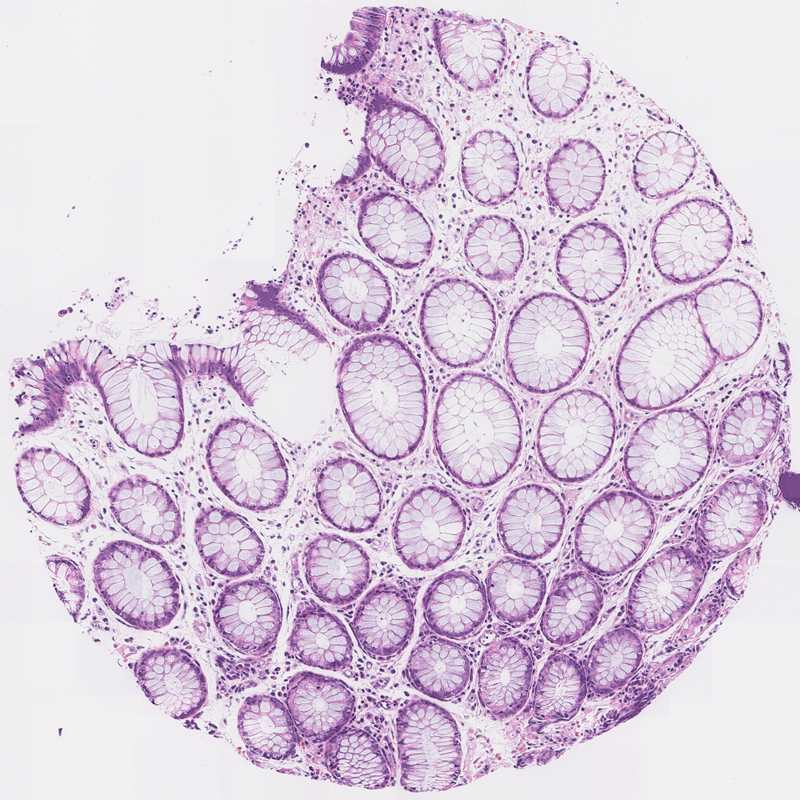
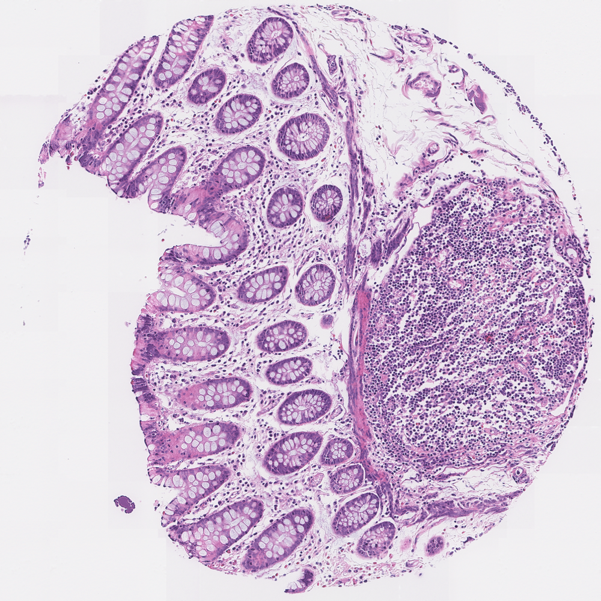

# **UTOM**: Unsupervised content-preserving transformation for optical microscopy.

[](https://ubuntu.com/)
[](https://www.python.org/)
[](https://pytorch.org/)

[](https://opensource.org/licenses/GPL-3.0)
[](https://github.com/Xinyang-Li/c2GAN/graphs/contributors)
[](https://www.biorxiv.org/content/10.1101/848077v2)
[](https://github.com/Xinyang-Li/c2GAN/graphs/commit-activity)

[](https://github.com/Xinyang-Li/c2GAN/issues)
[](https://img.shields.io/github/stars/Xinyang-Li/c2GAN?style=social)


## Contents


- [Overview](#overview)
- [Repo Structure](#repo-structure)
- [System Environment](#system-environment)
- [Demo](#demo)
- [Results](#results)
- [License](./LICENSE)
- [Issues](https://github.com/Xinyang-Li/c2GAN/issues)
- [Citation](#citation)

# Overview

Our work is based on Cycle-consistent Generative Adversarial Networks (**CycleGANs**) [[paper]](http://openaccess.thecvf.com/content_iccv_2017/html/Zhu_Unpaired_Image-To-Image_Translation_ICCV_2017_paper.html), which makes unsupervised training of CNNs possible and is really illuminating.


To correct mapping biases in the scenario of microscopy and provide a robust unsupervised learning method for deep-learning-based computational microscopy, we propose content-preserving CycleGAN (**UTOM**). By imposing additional **saliency constraint**, UTOM can complete pixel-wise regression tasks including image restoration (1-channel to 1-channel),  whole-slide histopathological coloration (1-channel to 3-channel), and virtual fluorescent labeling (13-channel to 3-channel), *etc*. 

Foremost, UTOM needs no pre-aligned training pairs. The laborious work of image acquisition, labeling, and registration can be spared. We release our source code here and hope that our work can be reproducible and offer new possibilities for image-to-image transformation in the field of microscopy, especially when the sample undergoes fast dynamics or preparing paired data is destructive for the sample. For more information and technical support please follow our update.

More details please refer to the companion paper where this method first occurred. [[paper]](https://www.biorxiv.org/content/10.1101/848077v1.abstract)

A readable **python code** of UTOM aiming at realizing unsupervised domain mapping in optical microscopy is provided in this repository. Next, we will guide you step by step to implement our method.

# Repo Structure

```
|---checkpoints
|---|---AF2HE_ck
|---|---|---latest_net_D_A.pth
|---|---|---latest_net_D_B.pth
|---|---|---latest_net_G_A.pth
|---|---|---latest_net_G_B.pth
|---data
|---|---######
|---datasets
|---|---AF2HE_datasets
|---|---|---trainA
|---|---|---trainB
|---|---|---testA
|---|---|---testB
|---images
|---|---some_images_for_README
|---models
|---|---neural_network_model
|---options
|---|---neural_network_para_set
|---results
|---util
|---LICENSE
|---README.md
|---test.py
|---train.py
|---script.py
```

# System Environment

* ubuntu 16.04 
* python 3.6.5
* **pytorch 1.3.1** 
* NVIDIA GPU + CUDA 10.0

## Building environment
We recommend configuring a new environment named *UTOM* on your machine to avoid version conflicts of some packages. We assume that *corresponding NVIDIA GPU support and CUDA 10.0* has been installed on your machine.
* Check your CUDA version
```
$ cat /usr/local/cuda/version.txt
```

* Build anaconda environment

```
$ conda create -n UTOM python=3.6
```

* Activate the *UTOM* environment and install pytorch

```
$ source activate UTOM
$ conda install pytorch=1.3.1
```

* Test if the installation is successful

```
$ python
>>> import torch
>>> print(torch.__version__)
```

# Demo

## Data processing

* You can download some **data** for demo code from [here](https://drive.google.com/open?id=1QPlLcTHlU58xo116KB1bd680EoMof_Wn). 

## Training

Start training.

```
$ python train.py --dataroot ./datasets/AF2HE_datasets --name AF2HE --model cycle_gan --input_nc 3 --output_nc 3 --lambda_identity 0.0 --gpu_ids 0 --load_size 512 --crop_size 512 --display_winsize 512
```

## Test the model

Start training.

```
$ python test.py --dataroot ./datasets/AF2HE_datasets --name AF2HE --model cycle_gan --input_nc 3 --output_nc 3 --gpu_ids 6 --load_size 512 --crop_size 512 --display_winsize 512 --num_test 2430
```

# Results
Some of our results are exhibited below. For more results and further analyses, please refer to the companion paper where this method first occurred. [[paper]](https://www.biorxiv.org/content/10.1101/848077v1.abstract)
### *In silico* histological staining learned from adjacent slide

|           Input           |           UTOM           |           Adjacent section           |
| :-----------------------: | :-----------------------: | :--------------------: |
|  |  |  |
|  |  |  |


# Citation

If you use this code please cite the corresponding paper where original methods appeared: 

["*Unsupervised content-preserving transformation for optical microscopy*".](https://www.biorxiv.org/content/10.1101/848077v1.abstract)

